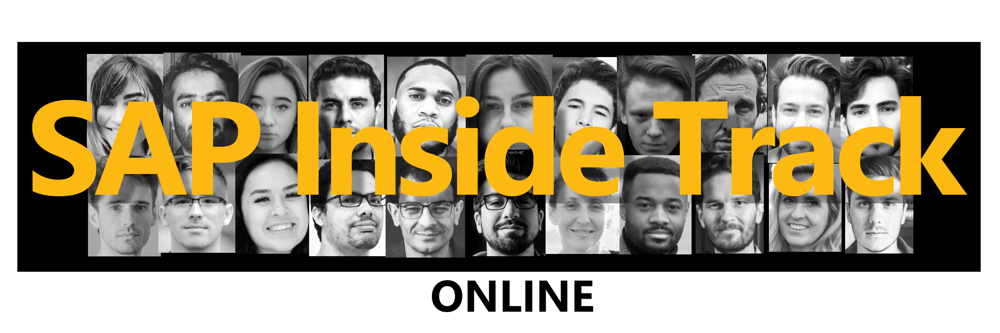

# SAP Inside Track Online 2020

## Intro
Welcome! 

This readme hopes to serve all the needs of organizers and volunteers. It will contain all necessary information, and guides on how to perform tasks.

## Table of contents
- [Intro](#intro) - Short introduction
- [Links](#links) - Links to various resources
- [Guides](#guides)
- [Image assets](#image-assets) - Official image assets
  
## Links
* Chat on the Discord server [[Link](https://discord.gg/EgmTNT)]
* Subscribe to the YouTube Channel [[Link](https://www.youtube.com/channel/UCbVRw2p01YO3xdn9aFfVIqg)]
* Link to submission form [[Link](https://forms.gle/Nw8HKV9QwuwaAD1w6)]
* Link to fundraising campaign [[Link](https://www.classy.org/give/t285233/#!/donation/checkout)]

### Short links to share
* YouTube Channel - http://bit.ly/sapsitonline-youtube
* Discord Server - http://bit.ly/sapsitonline-discord-invite
* Twitter - http://bit.ly/sapsitonline-twitter
* GitHub Pages landing page - http://bit.ly/sapsitonline
* Girls Who Code Fundraiser - http://bit.ly/sapsitonline-fundraiser

## Guides
* [Creating guides](./guides/creating-guides/creating-guides.md) - How to create a guide

## Image assets

### Banner

### Social badge

### Twitter banner

