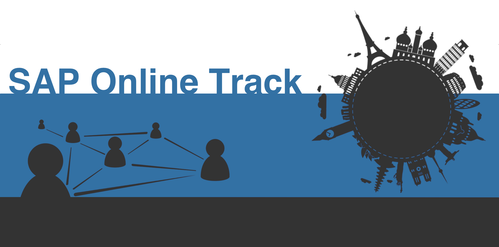

# SAP Inside Track Online 2020

## Intro
Welcome! 

This readme hopes to serve all the needs of organizers and volunteers. It will contain all necessary information, and guides on how to perform tasks. We use [Github Issues](https://github.com/SAP-Inside-Track-Online/sitONLINE-2020/issues) and [Github Projects](https://github.com/SAP-Inside-Track-Online/sitONLINE-2020/projects/1) to track tasks and ideas.

## Table of contents
- [Intro](#intro) - Short introduction
- [Links](#links) - Links to various resources
- [Guides](#guides)
- [Image assets](#image-assets) - Official image assets
- [Session title cards](./session-title-cards.md) - Generated title cards for all sessions, for speakers to use in their presentation
  
## Links
* Github Issues [Link](https://github.com/SAP-Inside-Track-Online/sitONLINE-2020/issues)
* GitHub Project [Link](https://github.com/SAP-Inside-Track-Online/sitONLINE-2020/projects/1)
* Chat on the Discord server [[Link](https://discord.gg/EgmTNT)]
* Subscribe to the YouTube Channel [[Link](https://www.youtube.com/channel/UCbVRw2p01YO3xdn9aFfVIqg)]
* Link to submission form [[Link](https://forms.gle/Nw8HKV9QwuwaAD1w6)]
* Link to fundraising campaign [[Link](https://www.classy.org/give/t285233/#!/donation/checkout)]
* Presentations from the event [[Link](presentations)]

### Short links to share
* YouTube Channel - http://bit.ly/saponlinetrack-youtube
* Discord Server - http://bit.ly/saponlinetrack-discord
* Twitter - http://bit.ly/saponlinetrack-twitter
* GitHub Pages landing page - http://bit.ly/saponlinetrack
* Girls Who Code Fundraiser - http://bit.ly/saponlinetrack-fundraiser
  
## Guides
* [Creating guides](./guides/creating-guides/creating-guides.md) - How to create a guide
* [Stream producer checklist](./guides/stream-producer/stream-producer.md) - How to be a stream producer
* [SAP Online Track Moderator Guide](./guides/moderator/moderator.md) - A guide to help moderators in their role

## Image assets

### Banner

### Social badge

### Twitter banner

