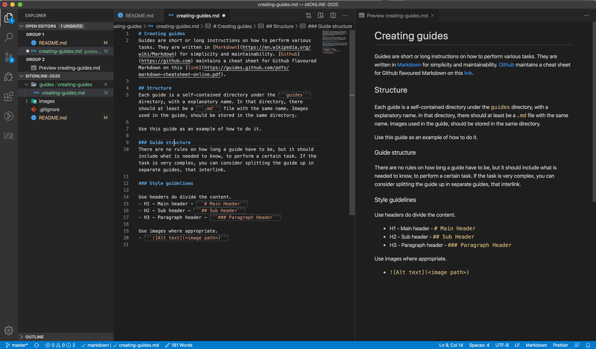

# Creating guides
[Back to readme](../../README.md)

Guides are short or long instructions on how to perform various tasks. They are written in [Markdown](https://en.wikipedia.org/wiki/Markdown) for simplicity and maintainability. [Github](https://github.com) maintains a cheat sheet for Github flavoured Markdown on this [link](https://guides.github.com/pdfs/markdown-cheatsheet-online.pdf).

## Table of contents
  - [Table of contents](#table-of-contents)
  - [Structure](#structure)
    - [Guide structure](#guide-structure)
    - [Style guidelines](#style-guidelines)

## Structure
Each guide is a self-contained directory under the ```guides``` directory, with a explanatory name. In that directory, there should at least be a ```.md``` file with the same name. Images used in the guide, should be stored in the same directory. 

Use this guide as an example of how to do it.

### Guide structure
There are no rules on how long a guide have to be, but it should include what is needed to know, to perform a certain task. If the task is very complex, you can consider splitting the guide up in separate guides, that interlink.

Add link to guide in ```Guides``` section in [README.md](../../README.md). And add a link back to [README.md](../../README.md) at the top of the guide, to be on the safe side. 

### Style guidelines

* Use headers do divide the content.
  - H1 - Main header - ```# Main Header```
  - H2 - Sub header - ```## Sub Header```
  - H3 - Paragraph header - ```### Paragraph Header```

* Use table of contents, if guide won't fit screen without scrolling.


* Use images where appropriate.
  - 
Code: ``````

* Link to other resources
  * [Link to Google](https://www.google.com) - ```[Link description](path/To/Resource)```