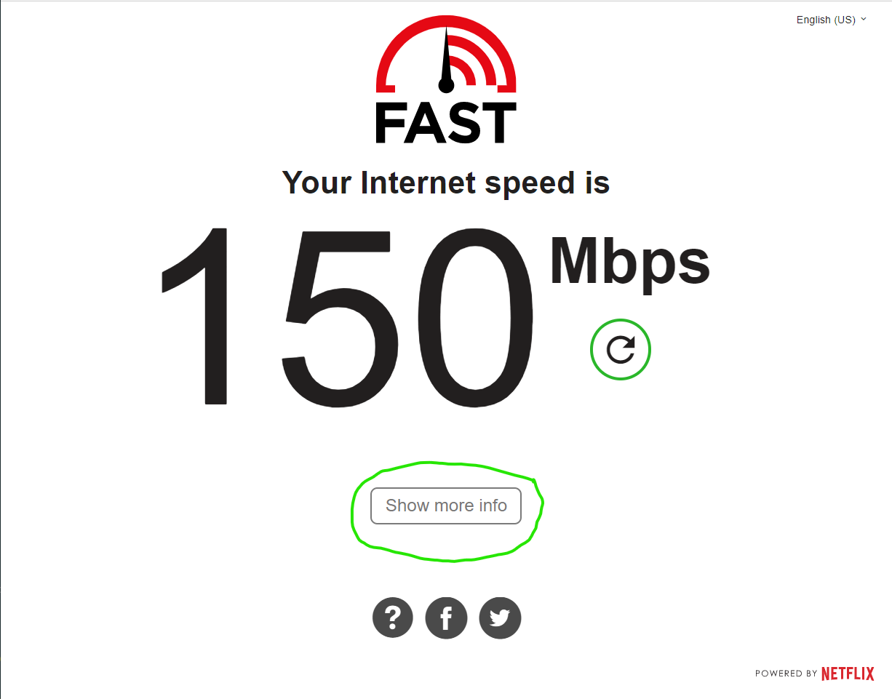
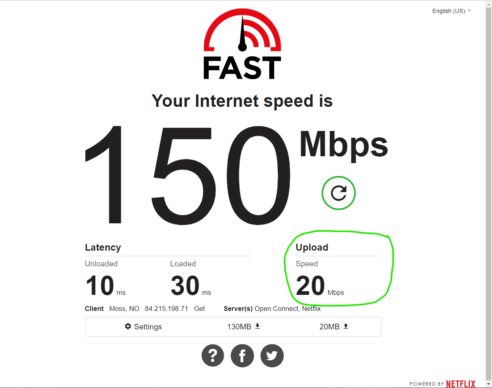

# Stream producer checklist
This guide will help stream producers with their task of getting presentations in "Easy Mode" to YouTube.

## Tools
* [Open Broadcasting Software (OBS)](https://obsproject.com/) - Streaming software alternative
* [Streamlabs OBS](https://streamlabs.com/) - Streaming software alternative
* [Sizer](http://www.brianapps.net/sizer/) - Window resize tool (Windows)
* [Macro Deck](https://www.macrodeck.org/) - A free [Stream Deck]() alternative, for remote control of OBS (Windows/Android only)
* [Touch Portal](https://www.touch-portal.com/) - A free [Stream Deck]() alternative, for remote control of OBS (Windows/macOS/Android/iOS)

## Networking
Use an ethernet connection if possible, but wifi is possible. Consider that stream producers will receive the video stream on Discord, and push out the stream to YouTube. That means that a steady high speed internet connection is needed. We stream at 720p 30fps. 

> ### Recommended connection speed for streaming to YouTube 
>For 720p video at 30 frames per second, the range is 1,500 to 4,000 kbps. That’s a speed between roughly 2 Mbps and 5 Mbps.
>
> So, if you’re streaming live video at a resolution of 720p, at 30 frames per second, you will upload up to 4,160 kilobits of data per second. So having an upload bandwidth of around 4 Mbps should cover you, right?
>
>Wrong. You will need to upload up to 4,160 kilobits of data per second constantly. Because these speeds fluctuate, it’s generally a good idea to have a 35-40% buffer. That puts us at an upload rate of around 5,700 kilobits per second, or 5.7 Mbps. ([Source](https://restream.io/blog/what-is-a-good-upload-speed-for-streaming/))
>

With the above recommendation in mind, and the fact that we also will have video in and out on Discord, stream producers should have at least a 10Mbps internet connection. Both for upload and download speed. Use [FAST.com](https://fast.com/) for testing your connection. Remember to press the "Show more info" button, to inspect your upload speed.

## Setting the scenes

Coming...

## Using Profiles to prepare sessions

Coming...

## Pre-flight check list
Use this pre-flight check list, to make sure everything is ready for the stream

- [ ] - Verify scheduled sessions and track channel on Discord
- [ ] - Connect to Discord track channel 15 minutes before session start
- [ ] - Verify OBS/Streamlabs is opened with correct session settings (stream key!)
- [ ] - Pop out voice channel window, and make sure OBS/Streamlabs captures it correctly
- [ ] - Coordinate with presenter in regards to Q&A from chat (during session, or at the end)
- [ ] - Verify Intro scene is selected in OBS/Streamlabs
- [ ] - Start stream
- [ ] - Monitor stream
- [ ] - End session on Intro scene
- [ ] - Stop stream
